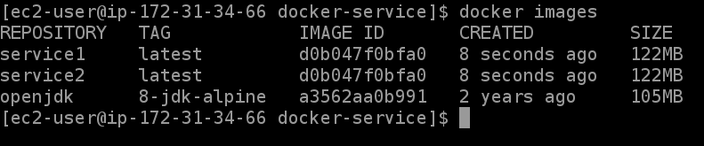
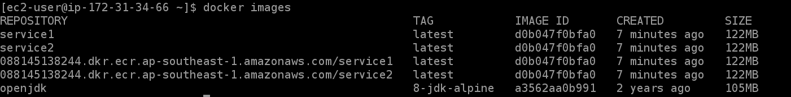
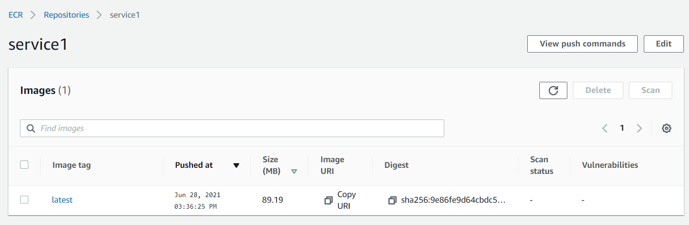
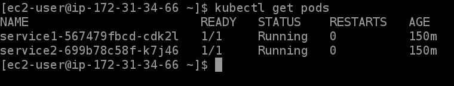
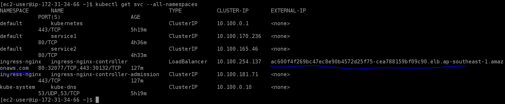

# MicroServices Deployment with EKS
Deploy 2 services into EKS and Nginx gateway.

Note: the information is from my test account, make sure you update the value correctly.

### Table of Contents
**[Prerequisite](#prerequisite)**<br>
**[Installing Tools](#installing-tools)**<br>
**[Deployment](#deployment)**<br>
**[Testing](#testing)**<br>
**[Clean Up](#clean-up)**<br>
**[Useful Commands](#useful-commands)**<br>

## Prerequisite
### AWS config
Make sure you configured the AWS credentials in
```shell
~/.aws/credentials
```

### Java project
In the example, I will use a Spring Boot microservice with 2 endpoints for testing.
```
GET /foo/hello
GET /bar/hello
```

The java main class look like this
```java
@RestController
@SpringBootApplication
public class ServerApplication {

    private static Logger logger = LoggerFactory.getLogger(ServerApplication.class);

    @ResponseBody
    @GetMapping("/foo/hello")
    public String fooHello() {
        logger.info("Say hello...");
        return "Foo Say Hello!";
    }

    @ResponseBody
    @GetMapping("/bar/hello")
    public String barHello() {
        logger.info("Say hello...");
        return "Bar Say Hello!";
    }

    public static void main(String[] args) {
        SpringApplication.run(ServerApplication.class, args);
    }
}
```

### Dockerize the java projects
Use maven to build jar file
```shell
mvn clean install
```

Use docker command to dockerize the jar files. \
The Dockerfile will look like this
```
FROM openjdk:8-jdk-alpine
COPY target/*.jar app.jar
ENTRYPOINT ["java","-jar","/app.jar"]
```

Run commands to dockerize the jar file to 2 services: *service1* and *service2*
```shell
docker build -t service1 .
docker build -t service2 .
```

List out the docker images


### Upload docker images to ECR
Go to [ECR Console](https://ap-southeast-1.console.aws.amazon.com/ecr/repositories?region=ap-southeast-1) page to create 2 repositories \
The names are *service1* and *service2*


Tag the images
```shell
docker tag service1 088145138244.dkr.ecr.ap-southeast-1.amazonaws.com/service1
docker tag service2 088145138244.dkr.ecr.ap-southeast-1.amazonaws.com/service2
```
Note: we can do multiple tags for keeping the old versions.

After tagging the images, there are 2 other images were created


Login into ECR (if this is the first time)
```shell
aws ecr get-login-password --region ap-southeast-1 | docker login --username AWS --password-stdin 088145138244.dkr.ecr.ap-southeast-1.amazonaws.com
```
You will get a message
```
Login Succeeded
```

So now we can push the images into ECR repositories
```shell
docker push 088145138244.dkr.ecr.ap-southeast-1.amazonaws.com/service1 --all-tags
docker push 088145138244.dkr.ecr.ap-southeast-1.amazonaws.com/service2 --all-tags
```
We can see the result in ECR Console page


We can do multiple tags by the following commands
```shell
docker tag service1 088145138244.dkr.ecr.ap-southeast-1.amazonaws.com/service1:latest
docker tag service1 088145138244.dkr.ecr.ap-southeast-1.amazonaws.com/service1:0.0.1
docker tag service2 088145138244.dkr.ecr.ap-southeast-1.amazonaws.com/service2:latest
docker tag service2 088145138244.dkr.ecr.ap-southeast-1.amazonaws.com/service2:0.0.1

docker push 088145138244.dkr.ecr.ap-southeast-1.amazonaws.com/service1 --all-tags
docker push 088145138244.dkr.ecr.ap-southeast-1.amazonaws.com/service2 --all-tags
```

*Now, the images are ready for running.*

## Installing Tools
### Install eksctl
Follow: https://docs.aws.amazon.com/eks/latest/userguide/eksctl.html \
More information: https://eksctl.io/

### Install kubectl
Follow: https://kubernetes.io/docs/tasks/tools/

## Deployment
### Create an EKS cluster
Note: this will take around 15 minutes for completing all stuffs \
The cluster configuration in the *cluster.yaml*
```
apiVersion: eksctl.io/v1alpha5
kind: ClusterConfig

metadata:
  name: eks-fiverr
  region: ap-southeast-1

nodeGroups:
  - name: fiverr-1
    instanceType: t2.micro
    desiredCapacity: 1
  - name: fiverr-2
    instanceType: t2.micro
    desiredCapacity: 1
  - name: fiverr-3
    instanceType: t2.micro
    desiredCapacity: 1
```

Run command to create cluster
```shell
eksctl create clsuter -f cluster.yaml
```

After the cluster was created, we can check by using command
```shell
kubectl get pods
```
It will return the number of running pods, empty for this case.

### Deploy service1 and service2
The service1 configuration in *service1-deployment.yaml* and *service1-service.yaml* \
The service2 configuration will be similar
#### service1-deployment.yaml
```
apiVersion: apps/v1
kind: Deployment
metadata:
  name: service1
  namespace: default
spec:
  replicas: 3
  selector:
    matchLabels:
      app: service1
  template:
    metadata:
      labels:
        app: service1
    spec:
      containers:
        - name: service1
          image: 088145138244.dkr.ecr.ap-southeast-1.amazonaws.com/service1:latest
          imagePullPolicy: Always
          ports:
            - containerPort: 8080
              protocol: TCP
```

#### service1-service.yaml
```
apiVersion: v1
kind: Service
metadata:
  name: service1
spec:
  selector:
    app: service1
  ports:
    - protocol: TCP
      port: 80
      targetPort: 8080
```

Run the commands for deploying *service1* and *service2*
```shell
kubectl apply -f service1-deployment.yaml
kubectl apply -f service1-service.yaml
kubectl apply -f service2-deployment.yaml
kubectl apply -f service2-service.yaml
```

Check the pods by command
```shell
kubectl get pods
```


### Deploy Nginx Ingress Gateway
Before install the Nginx gateway, need to install some mandatory stuffs
```shell
kubectl apply -f https://raw.githubusercontent.com/kubernetes/ingress-nginx/controller-0.32.0/deploy/static/provider/aws/deploy.yaml
```

The Nginx Ingress gateway configuration in *gateway-deployment.yaml*
```
apiVersion: extensions/v1beta1
kind: Ingress
metadata:
  name: gateway
spec:
  rules:
  - http:
      paths:
        - path: /foo
          backend:
            serviceName: service1
            servicePort: 80
        - path: /bar
          backend:
            serviceName: service2
            servicePort: 80
```

Run the command to install
```shell
kubectl apply -f gateway-deployment.yaml
```

We can get all services to know the public domain for Nginx Gateway
```shell
kubectl get svc --all-namespaces
```


Note: need to wait some minutes before using the domain
```
ac600f4f269bc47ec8e90b4572d25f75-cea788159bf09c90.elb.ap-southeast-1.amazonaws.com
```

## Testing
Call endpoints and see the responses
```
GET - ac600f4f269bc47ec8e90b4572d25f75-cea788159bf09c90.elb.ap-southeast-1.amazonaws.com/foo/hello
GET - ac600f4f269bc47ec8e90b4572d25f75-cea788159bf09c90.elb.ap-southeast-1.amazonaws.com/bar/hello
```

## Clean Up
```shell
kubectl get svc --all-namespaces
kubectl delete svc <service-name>
eksctl delete cluster --name <prod>
```

## Useful Commands
### Get running pods
```shell
kubectl get pods
```

### Scale up/down
```shell
kubectl scale deployment <deployment-name> --replicase=<number-of-pods>
```

### Tail logs
```shell
kubectl logs -f <pod-name>
```

### Port forwarding
```shell
kubectl port-forward pod/<pod-name> <local-port>:<pod-port>
```